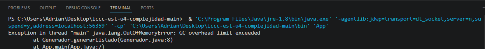

# Práctica: 04.01 Complejidad Proyecto JAVA

## Datos del Estudiante
- **Nombre:** Jose Adrian Plaza Salto
- **Curso:** Estructura de Datos G2
- **Fecha:** 14/04/2026

---

## 1. [Título de la sección] o [Practica]
**Fecha:** 15/04/2026

**Descripción:** Creamos el proyecto y lo subimos a Github

---

## 2. icc-est-u4-complejidad

**Fecha:** 15/04/26
**Descripción:** Creamos la clase Estuantes y Generadores y creamos un listado de estudiantes con datos aleatorios para buscar y optimizar la busqueda

---
